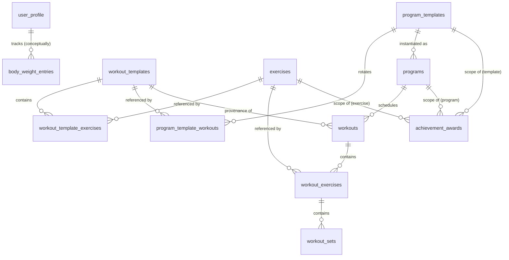

# Client data model

Everything a developer needs to know about the local (client-side) data
model. The client is **local-first**: IndexedDB is the source of truth and
the app is fully functional with no server at all. Syncing (see
[sync.md](./sync.md)) is optional and layered on top.

## Where things live

| Concern | File |
| --- | --- |
| Canonical schema (SQL DDL) | `backend/sql/schema.sql` |
| TypeScript mirror + store registry | `frontend/src/lib/db/types.ts` |
| IndexedDB connection + migrations | `frontend/src/lib/db/db.ts` |
| CRUD helpers | `frontend/src/lib/db/repo.ts` |
| Export / import / clear | `frontend/src/lib/db/export.ts` |
| Dev seeds | `frontend/src/lib/db/seed.ts` (see [seeding.md](./seeding.md)) |

`backend/sql/schema.sql` is the **single source of truth**. The IndexedDB
object stores in `types.ts` mirror its tables 1:1 by field name, and the Go
backend's sync metadata (`backend/sync.go`) mirrors it column-for-column.
When the model changes, all three move in lockstep (checklists below).

## The sync envelope

Every synced entity extends `SyncFields` (`types.ts`):

```ts
interface SyncFields {
  id: string;                 // UUID v4, generated client-side (offline-safe)
  updated_at: string;         // UTC ISO 8601, client-set; LWW conflict field
  deleted_at: string | null;  // tombstone — rows are never hard-deleted
  server_seq: number | null;  // server-assigned cursor; null until accepted
}
```

Key consequences:

- **Soft deletes only.** `repo.softDelete()` sets `deleted_at`; every read
  helper in `repo.ts` filters tombstones out. Never hard-delete a synced row
  — deletions must be able to sync.
- **`updated_at` is the conflict resolver** (last-write-wins). `repo.put()`
  stamps it on every write. The one deliberate exception: the sync client
  writes back `server_seq` without touching `updated_at`, because that isn't
  a user edit (`frontend/src/lib/sync.ts`).
- **`server_seq` is the sync cursor**, assigned by the server from a single
  global counter. Wall-clock time is never used as a cursor.

## Entities and relationships



The model has a deliberate **template → instance** split:

- `workout_templates` / `workout_template_exercises` describe what a session
  *should* look like (planned exercises, set counts, optional targets,
  superset groups).
- `program_templates` / `program_template_workouts` describe a reusable
  weekly blueprint: frequency, duration, preferred days, and the ordered
  rotation of workout templates.
- `programs` are **instances** of a program template. Config fields
  (name, frequency, days, dates…) are *snapshots* taken at start time, so
  editing a template later never rewrites an in-flight or historical program.
- `workouts` are instances of a session — scheduled by a program or started
  ad-hoc. When a workout starts, its template's exercises are *copied* into
  `workout_exercises` / `workout_sets` (`startWorkout()` in
  `frontend/src/lib/services/workouts.ts`), which the user then edits to
  what was actually performed.
- `workout_sets` is the ground truth. Personal records are **derived** from
  it, never stored (see [records-and-achievement.md](./records-and-achievement.md)).
  Achievement *awards* are the exception: earned once, they persist in
  `achievement_awards`.

### Workout lifecycle

`workouts.state`: `scheduled → in_progress → completed`, or `skipped`.
Bumping a missed workout keeps `state='scheduled'`, moves `scheduled_on`,
and records the first original date in `original_scheduled_on` (non-null =
"was bumped"). See `applyBumps()` in `services/workouts.ts`.

## Conventions

- **Units are canonical**: weight in kg, distance in km, duration in
  seconds — always, in every store. Display units (`kg`/`lbs`, `km`/`mi`)
  are a `user_profile` preference applied at render time only
  (`frontend/src/lib/utils/units.ts`).
- **Dates**: calendar fields (`scheduled_on`, `measured_on`, `started_on`…)
  are local `YYYY-MM-DD` strings; record-keeping fields (`*_at`) are UTC
  ISO 8601 timestamps. Parsing always goes through
  `frontend/src/lib/utils/dates.ts` (`parseLocalDate`), never
  `new Date('YYYY-MM-DD')`, which would interpret the string as UTC.
- **JSON columns** (`body_parts`, `preferred_days`,
  `highlighted_exercise_ids`, `image_urls`) are arrays client-side and JSON
  text in sqlite; the sync layer converts (see `jsonCols` in
  `backend/sync.go`).
- **Defensive reads for added fields**: a field added after launch may be
  `undefined` on old rows. Type it optional and read with a default, e.g.
  `profile?.weight_chart_months ?? 3`.

## IndexedDB specifics

`db.ts` opens the `workoutt` database with **append-only versioned
migrations**: `MIGRATIONS` is an ordered list, one function per version,
run in sequence from the client's current version. Rules:

- Never edit a shipped migration — append a new one.
- v1 creates every store in the `STORES` map, so a migration that adds a
  store must guard with `db.objectStoreNames.contains(...)` (fresh installs
  already created it via v1; see the v3 `achievement_awards` migration).
- `sync_meta` (cursors, timestamps) is deliberately **not** in `STORES`: it
  is device-local bookkeeping, never synced or exported.

Indexes mirror the SQL ones, declared in the `STORES` map. `body_parts`
uses a `multiEntry` index over the array (the SQL side uses `json_each()`
instead).

## CRUD helpers (`repo.ts`)

```ts
withSyncFields(fields)        // attach id + sync envelope to a new entity
all<T>(store)                 // read all, tombstones filtered
get<T>(store, id)             // read one, tombstone-aware
byIndex<T>(store, index, val) // indexed read, tombstones filtered
put(store, row)               // insert/update, stamps updated_at
bulkPut(store, rows)          // one transaction, for seeds/imports
softDelete(store, id)         // tombstone one row
softDeleteMany(store, ids)    // tombstone many in one transaction
```

Always create rows through `withSyncFields` and write through
`put`/`bulkPut` so the envelope stays correct.

## Export / import (`export.ts`)

Two scopes:

- `templates` — the shareable building blocks (`exercises`,
  `workout_templates`, `workout_template_exercises`, `program_templates`,
  `program_template_workouts`).
- `templates_user` — everything above plus user data (`user_profile`,
  `body_weight_entries`, `programs`, `workouts`, `workout_exercises`,
  `workout_sets`, `achievement_awards`).

Exports are JSON envelopes with a `scope` marker; import validates store
names against `STORES`. `clearAllData()` wipes every store **including**
`sync_meta`.

## Checklist: adding a field to an existing entity

1. `frontend/src/lib/db/types.ts` — add to the interface; optional (`?`) if
   old rows won't have it, with a doc comment stating the default.
2. `backend/sql/schema.sql` — add the column (with a sensible `DEFAULT`).
3. `backend/sync.go` — add the column name to that table's `columns` list
   (and to `jsonCols`/`boolCols` if applicable).
4. Read defensively everywhere: `row.field ?? <default>`.

No IndexedDB migration is needed for a field — object stores are
schemaless.

## Checklist: adding a new synced store

1. `types.ts` — interface extending `SyncFields` + entry in `STORES`.
2. `db.ts` — append a migration creating the store, guarded with
   `objectStoreNames.contains(...)`.
3. `schema.sql` — the table, with the standard `updated_at` /
   `deleted_at` / `server_seq` tail.
4. `sync.go` — add to `tableOrder` (parents before children!) and to the
   `tables` metadata map.
5. `export.ts` — add to `TEMPLATE_STORES` or `USER_STORES`.
6. The frontend sync client needs **no change** — it iterates `STORES`.
