# Notification system — plan

A plan for reminding users about their training, under Workoutt's hard
constraint: **no server, everything in the browser, works offline.** The app
is already an installable PWA (`frontend/public/manifest.webmanifest`) with a
shell-caching service worker (`frontend/public/sw.js`, registered in PROD from
`Layout.astro`) and IndexedDB as the source of truth.

## What we want to fire

| # | Trigger | Timing | Data it keys off |
| --- | --- | --- | --- |
| 1 | **Next workout reminder** | at/around a scheduled workout | `workouts.scheduled_on` (a local `YYYY-MM-DD`), `state = 'scheduled'` |
| 2 | **Stale open workout** | 45 min after a workout is started but not finished | `workouts.started_at` (UTC ISO), `state = 'in_progress'` |

## The core problem (read this first)

The web has **no reliable, serverless way to fire a notification while the app
is fully closed.** Every "closed-app" mechanism is either server-dependent,
Chromium-only, coarse, or unshipped:

| Mechanism | Fires when app closed? | Serverless? | Reality |
| --- | --- | --- | --- |
| `registration.showNotification()` from a live page/SW | no | yes | Works everywhere, but only while something is alive. |
| **Notification Triggers** (`TimestampTrigger`) | yes | yes | *Exactly* what we'd want — but Chromium-only, never left origin trial, not shippable. |
| **Web Push** (Push API + VAPID) | yes | **no** | Cross-browser (incl. iOS 16.4+ installed PWAs) but **requires a push server** to send the message. Violates "no server." |
| **Periodic Background Sync** | yes (wakes SW) | yes | Chromium + installed PWA + engagement heuristics; min ~12 h, timing not guaranteed. Not on iOS/Firefox. |
| One-off **Background Sync** | on reconnect, not by time | yes | Event is connectivity, not schedule. Wrong tool. |
| `setTimeout` inside the SW | no | yes | SWs are killed after ~30 s idle; long timers don't survive. |

**Conclusion:** a purely serverless design can only be **best-effort**. It is
fully reliable when the app (or, on Chromium, its SW) is alive, and
**catch-up** otherwise. That is an honest, useful product for a local-first
tracker — but the limits below must be set with the user, not hidden.

## Recommended approach — durable schedule + opportunistic flush

Treat notifications as **derived, durable intents** in IndexedDB that any live
context drains. Nothing depends on a background timer surviving.

```mermaid
flowchart TD
    subgraph Write path
      A[workout scheduled / started / finished] --> B[syncSchedule&#40;&#41;]
      B --> C[(scheduled_notifications<br/>in IndexedDB)]
    end
    subgraph Fire path whichever wakes first
      D[app open / visibilitychange] --> F[flushDue&#40;&#41;]
      E[in-page setTimeout while page alive] --> F
      G[SW periodic sync — Chromium only, bonus] --> F
      F --> C
      F -->|fire_at \<= now, still relevant| H[showNotification via SW]
      H --> I[mark shown / dedupe]
    end
    H --> J[notificationclick → focus app at workout]
```



### Data model (one new synced-optional store)

```
scheduled_notifications
  id            TEXT UUID (PK)
  kind          TEXT  'next_workout' | 'stale_workout'
  fire_at       TEXT  UTC ISO 8601 — when it becomes due
  expires_at    TEXT  UTC ISO — after this, drop silently (staleness cap)
  workout_id    TEXT  the subject
  dedupe_key    TEXT  e.g. 'next_workout:<workout_id>' — one live intent per subject
  state         TEXT  'pending' | 'shown' | 'cancelled'
  updated_at, deleted_at, server_seq   (standard envelope)
```

- **Idempotent by `dedupe_key`** — recomputing the schedule never creates
  duplicates, the same discipline the XP ledger and achievement awards use.
- Local-only is fine, but adding it to the sync stores lets a "shown" mark
  suppress the same reminder on another device (best-effort; see shortcomings).

### The pieces

1. **`lib/notifications/schedule.ts`** — pure-ish scheduler:
   - `syncSchedule()` — from current workouts, upsert one `next_workout` intent
     for the next scheduled workout (fire_at = `scheduled_on` + the user's
     reminder time, e.g. 08:00 local or "N minutes before"), and manage the
     `stale_workout` intent as workouts start/stop. Cancel intents whose
     workout changed date, completed, or was deleted.
   - `flushDue()` — load `pending` where `fire_at ≤ now < expires_at` and the
     underlying workout is still in the expected state, then show + mark
     `shown`. Skips (and cancels) anything stale so we never fire a 3-day-old
     "time to train."
2. **Live triggers (baseline, works everywhere):**
   - On app load and on `visibilitychange → visible`, call `syncSchedule()`
     then `flushDue()`.
   - A light in-page `setInterval` (e.g. 60 s) while a tab is open catches
     due intents without needing a reopen.
   - **Stale-open-workout while the page is alive** is the easy, reliable case:
     `ActiveWorkoutApp` sets a `setTimeout(started_at + 45min − now)` that fires
     precisely; cleared on finish/leave. The IndexedDB intent is the backup for
     "tab was closed before 45 min elapsed" → shown on next open.
3. **Service-worker additions (`sw.js`):**
   - `notificationclick` → focus an existing client or open the app at the
     workout (`clients.matchAll` / `openWindow`).
   - A `message` handler so the page can delegate `showNotification` to the SW
     (needed for notification *actions* and for showing from the SW itself).
   - **Optional, Chromium-only bonus:** register `periodicSync` ('flush-notes')
     whose handler runs `flushDue()`. Improves closed-app delivery on
     Android/desktop Chrome; treated as a nicety, never the contract.
4. **Permission + settings** — a Settings → "Reminders" card:
   - An enable toggle that calls `Notification.requestPermission()` **from the
     user gesture** (permission can't be requested silently).
   - Per-kind toggles and the next-workout reminder time.
   - Reflect `Notification.permission === 'denied'` with guidance to re-enable
     in the browser (we can't reprompt once denied).

### Serverless escape hatch for the *scheduled* case — calendar export

For trigger #1 only, we can sidestep the closed-app problem entirely: generate
an **`.ics` calendar event** (with a `VALARM`) for each scheduled workout and
let the user add it to their OS calendar. The operating system then owns the
alarm — genuinely serverless, offline, closed-app, cross-platform. It does not
help trigger #2 (there's no scheduled time to hand a calendar). Worth shipping
as a complement, not a replacement.

## Server-assisted (recommended, now that a server is acceptable)

The existing sync server (`backend/`, Go + SQLite, `POST /sync/push` /
`GET /sync/pull`) already **holds the workout data** — `workouts.scheduled_on`,
`started_at`, and `state` all sync to it. That is the whole game: the server
can decide *when* to notify entirely from data it already has, and **Web Push**
lets it wake the closed app. No new scheduling protocol is needed — a ticker, a
query, and a push send.

This becomes the primary path; the serverless design above is the **fallback**
for devices with no push subscription (offline-only mode, or iOS not installed
to the home screen).

### Why it fits the existing server so cleanly

- The server is the source of truth for `workouts`, so "which reminders are
  due" is a plain SQL query — no client round-trip, no intent-relay protocol.
- It's already a long-running Go process; adding a `time.Ticker` goroutine is
  a few lines. "Due" is *derived* from workout rows + a small sent-log, so the
  scheduler is crash-safe: on restart it recomputes and the sent-log prevents
  re-sends.
- Delivery goes through the browser vendor's push service (FCM / Mozilla /
  Apple), which queues for offline devices and delivers on reconnect — exactly
  what "you left a workout open" wants.

```mermaid
flowchart LR
    subgraph Client
      A[Settings: enable reminders] --> B[Notification.requestPermission&#40;&#41;]
      B --> C[pushManager.subscribe&#40;VAPID pub key&#41;]
      C --> D[POST /push/subscribe]
      SW[SW push handler] --> N[showNotification]
    end
    subgraph Sync server
      D --> E[(push_subscriptions<br/>server-only)]
      F[time.Ticker ~60s] --> G[query workouts + sent_log]
      G -->|due & unsent| H[webpush send to each sub]
      H --> I[(sent_notifications)]
    end
    G -.reads.-> W[(workouts — already synced)]
    H -->|encrypted push| PS[vendor push service]
    PS -->|wakes SW| SW
```



### Pieces to add

1. **VAPID keys** — generate once, private key in a server env var, public key
   shipped to the client. Identifies the sender to the push service.
2. **`push_subscriptions` (server-only table, not in the LWW sync set)** — each
   row is one browser's `{endpoint, p256dh, auth}` plus a device label. It's
   device-specific and holds a secret, so it should *not* fan out to all
   devices via sync. New endpoints: `POST /push/subscribe`,
   `POST /push/unsubscribe`. On a `404`/`410` from the push service, delete the
   dead subscription.
3. **Scheduler goroutine** — a `time.Ticker` (~60 s). Each tick, in one tx:
   - **next_workout:** `state='scheduled'` and `scheduled_on` + reminder-offset
     is now-ish and no `sent_notifications` row for `(next_workout, workout_id)`.
   - **stale_workout:** `state='in_progress'`, `completed_at IS NULL`,
     `started_at + 45m < now`, unsent.
   Send Web Push to every subscription, then insert the `sent_notifications`
   dedupe rows in the same tx.
4. **`sent_notifications` (server-only)** — `(kind, workout_id)` unique; makes
   the scheduler idempotent and crash-safe.
5. **Web Push send** — a small library (e.g. `webpush-go`) does the ECDH
   encryption + VAPID signing. The server needs **outbound HTTPS to the push
   endpoints** (see shortcomings).
6. **Service worker** — add `push` (show the notification from the payload) and
   `notificationclick` (focus an existing client or `openWindow` at the
   workout). These are the only SW additions.
7. **Client subscribe flow** — the Settings "Reminders" card requests
   permission on the user gesture, calls `pushManager.subscribe`, and POSTs the
   subscription. Nothing sensitive is kept client-side beyond the handle.

The client-side `scheduled_notifications` store and opportunistic `flushDue()`
from the serverless design still ship — they cover the fallback devices and let
reminders show instantly while the app is open without waiting on a round-trip.

- **Closed-app delivery is not guaranteed serverlessly.** If the PWA is fully
  closed and no periodic-sync wake occurs, reminders arrive on next open, not
  on time. This is the fundamental limit; the calendar export is the only true
  workaround, and only for scheduled workouts.
- **iOS/Safari is the worst case:** no Notification Triggers, no periodic sync;
  web push exists only for home-screen-installed PWAs (16.4+) and still needs a
  server. On iOS the system is effectively "catch-up on open" + calendar.
- **SW lifetime:** no long-lived timers in the SW (~30 s idle kill), so the
  45-min stale check cannot live there — it lives on the page, with IndexedDB
  catch-up as backup.
- **Permission friction:** must be user-initiated; if denied we cannot
  re-prompt; iOS needs the PWA installed first.
- **Timing is fuzzy:** periodic sync min interval ~12 h and is engagement- and
  battery-gated; the in-page interval only runs while a tab lives. Expect
  minutes-to-hours of slack when relying on background wakeups.
- **Clock & timezone:** `scheduled_on` is a *local date*; DST, travel, and
  manual clock changes can shift `fire_at`. Recompute on load and use tolerant
  windows rather than exact equality.
- **Duplicate / stale delivery:** needs the `dedupe_key` + `expires_at` +
  state-recheck so a reminder isn't shown twice (two tabs, a reopen) or long
  after it mattered.
- **Multi-device (once sync is on):** a reminder shown on the phone can still
  fire on the laptop; syncing the `shown` state reduces but can't eliminate
  double-fires without a coordinating server.

### Extra caveats specific to the server-assisted path

- **The *server* needs outbound internet, not the device.** Push is delivered
  by the vendor's service; your server must reach FCM/Mozilla/Apple endpoints.
  A LAN-only self-hosted box with no egress can sync but cannot push.
- **iOS still requires an installed PWA** (16.4+) before it will hand out a
  push subscription; until then that device falls back to catch-up-on-open.
- **Granularity = ticker cadence** (~1 min of slack). Fine for these reminders.
- **Stale synced data → spurious pushes.** If a device finishes a workout
  offline, the server still sees `in_progress` and may fire "did you forget?".
  Mitigations: send each reminder once (sent-log), phrase it as a gentle check,
  and let the next sync self-correct the state.
- **Multi-device fan-out.** The server pushes to every subscription, so a
  reminder rings on all signed-in browsers. Desirable for "left it open," maybe
  noisy for "next workout" — optionally target the most-recently-synced device.
- **Auth & secrets.** The server has no auth today (single-user LAN). Exposing
  push publicly needs a shared secret on `/push/*` and careful VAPID
  private-key handling.

## Suggested build order

**If staying serverless** (offline-first, no egress):

1. `scheduled_notifications` store (data-model checklist) + `schedule.ts`
   (`syncSchedule` / `flushDue`), unit-testable.
2. Wire live triggers: app-load + `visibilitychange` flush; `ActiveWorkoutApp`
   45-min `setTimeout` for the reliable stale-workout path.
3. SW `notificationclick` + `message`-to-show; Settings "Reminders" card with
   the permission gesture and reminder-time setting.
4. Progressive enhancement: `periodicSync` registration (Chromium) and the
   `.ics` export for scheduled workouts.

**With the sync server (recommended for reliable closed-app delivery):**

1. Steps 1–3 above — the client store, flush, permission UI, and SW
   `notificationclick` are shared, and give an immediate in-app experience.
2. Server: VAPID keys, `push_subscriptions` + `sent_notifications` tables, and
   `POST /push/subscribe` / `unsubscribe`.
3. Server: the `time.Ticker` scheduler querying `workouts` + the sent-log, and
   Web Push send via `webpush-go`.
4. Client: SW `push` handler; Settings subscribe flow POSTing the subscription.
5. Harden if ever exposed: shared secret on `/push/*`, subscription cleanup on
   `404`/`410`, optional most-recent-device targeting.
