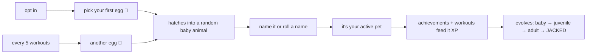
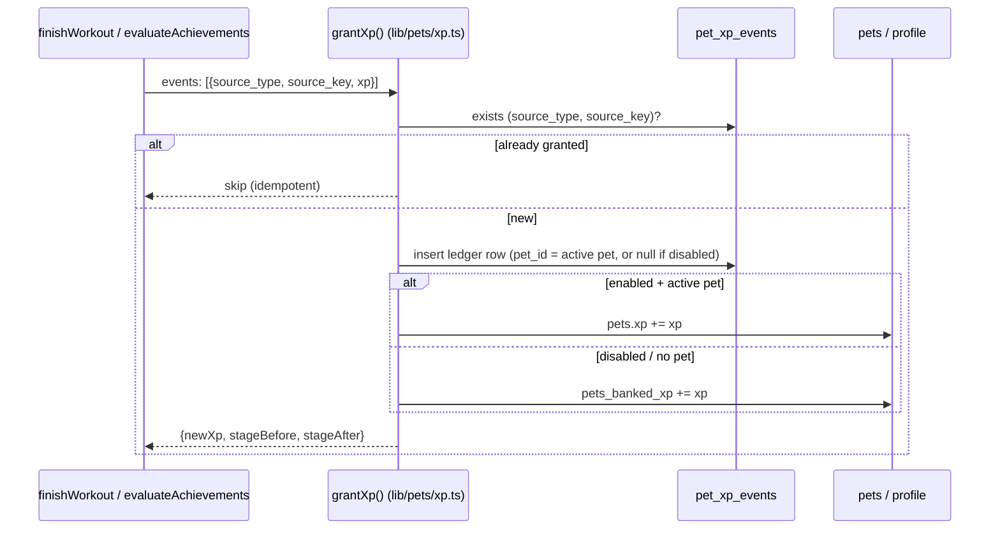

# Pet collection game — plan

An optional, opt-in collection game layered on top of the existing
achievements system (see `acheivements.md` and
`docs/dev/records-and-achievement.md`): training earns XP, XP evolves
pixel-art animals from babies into jacked beasts, and eggs earned by
consistency grow the collection.

Everything follows the app's established patterns: local-first synced
stores, derived-where-possible / durable-where-earned, definitions in code,
idempotent evaluation.

## Goals & principles

- **Strictly optional.** Off by default; enabling/disabling never touches
  training data. When off, nothing pet-related renders anywhere.
- **Ride the existing pipelines, don't fork them.** XP is a side effect of
  the two events the app already handles: an achievement award being
  inserted (`evaluateAchievements()` in
  `frontend/src/lib/achievements/evaluate.ts`) and a workout completing
  (`finishWorkout` flow in `ActiveWorkoutApp.svelte`). No new evaluation
  passes.
- **Idempotent XP.** XP is granted per *unique event* (an award row's
  tuple, a workout id), and grants are recorded, so re-evaluation, sync
  replays, and imports can never double-pay.
- **Sync-friendly.** Pets and the XP ledger are ordinary synced stores with
  the standard envelope (`id`/`updated_at`/`deleted_at`/`server_seq`).

## The loop (player's view)



## Mechanics

### 1. Opt-in

- **Onboarding**: one new optional row on the existing form — a checkbox
  like *"Hatch a workout buddy? (optional collection game)"*. Checked →
  after submit, route through the egg-hatch flow before the program-modal
  step. Unchecked → nothing changes.
- **Settings**: a "Pet game" card with an enable/disable toggle (plus the
  re-enable choice described in §8).
- State lives on `user_profile.pets_enabled` (synced, so all devices
  agree).
- **Opt-in grant, regardless of history**: exactly **1 egg** and a
  retroactive XP credit **capped at 1000** (one free full evolution). The
  credit comes from the achievements backfill — existing awards pay XP
  through the normal ledger until the cap is hit; awards beyond the cap
  are ledgered at 0 so they can never pay later. A veteran maxes their
  first pet immediately; everything after that is earned.

### 2. XP sources and scores

Every achievement definition gets an `xp` field in the catalogue
(`frontend/src/lib/achievements/catalogue.ts`); each *award row* (i.e. each
tier, each scope) pays out once. Suggested scores by effort:

| Source | XP |
| --- | --- |
| Completing a workout | 40 flat — no per-exercise bonus, and "submit without stats" completions pay the same 40 |
| Tier-less / tier-I achievements (First steps, Ten-timer, Century…) | 15 |
| Tier II | 25 |
| Tier III / rare account ones (Streak, Well-rounded, 100 workouts) | 40 |

Average achievement ≈ 20 XP — that's the number the balance math uses; the
catalogue can tune per-definition freely because `xp` lives next to each
tier.

### 3. Eggs and hatching

- One egg is granted at opt-in; one more for every **5 completed workouts**
  while the feature is enabled (a lifetime counter, not a streak — missing
  days never loses progress toward an egg).
- Hatching draws a random species **the user doesn't own yet** — no
  duplicates, ever. Once all 14 are collected, egg accrual stops (the
  workouts-toward-egg counter freezes; the Pets page swaps the egg-progress
  line for a "collection complete 🏆" state).
- Species roster (14): Turtle, Frog, Crab, Lion, Octopus, Pangolin,
  Dragon, Snake, Parakeet, Monkey, Cow, Minotaur, Hamster, Scorpion.
- **Naming**: free-text input, or a "Roll a name" button. Generated names
  come from a small in-code list per species (alliteration encouraged:
  "Tank" the turtle, "Deadlift Dave" the dragon…) — pure function, no data.
- Unhatched eggs accumulate (`pets_eggs_available`); the Pets page shows
  them and hatching is always user-initiated (it's the fun part — never
  auto-hatch).

### 4. The collection and the active pet

- The user owns any number of pets; exactly **one is active** at a time
  (profile field `active_pet_id`).
- **Only the active pet gains XP.** Switching is free and instant —
  strategy is "who am I raising right now", not a punishment.
- If the active pet is fully evolved, XP still accrues to it (harmless) —
  the UI nudges the user to activate a younger pet instead.

### 5. Evolution levels

Four stages driven by lifetime XP of that pet:

| Stage | Name | XP threshold |
| --- | --- | --- |
| 1 | Baby | 0 |
| 2 | Juvenile | 250 |
| 3 | Adult | 550 |
| 4 | Jacked | 1000 |

Escalating gaps (250 / 300 / 450) make the last stage feel earned.
Evolution is a pure derivation from `pet.xp` — never stored, so balance
changes retro-apply cleanly (same philosophy as PRs).

### 6. Balance check

Target: fully evolve one animal in **~50 achievements or ~20 workouts**.

- 50 achievements × ~20 XP avg = **1000 XP** ✓
- 20 workouts × 40 XP = 800 XP — but workouts *generate* achievements
  (First steps, Consistency I, a spread of Ten-timers and One tonnes…), so
  20 real workouts comfortably clear the remaining ~200 XP in practice ✓
- A fresh user doing 3 workouts/week fully evolves their first pet in
  roughly 4–6 weeks, right when novelty needs reinforcing.
- Egg pacing: every 5 workouts ≈ 250 XP ≈ one evolution stage — so the
  collection grows at about the rate one pet matures. Collecting all 14
  species (1 opt-in egg + 13 earned) ≈ 65 workouts (~5 months at 3/week):
  a good long tail.

Numbers to keep in one place (`frontend/src/lib/pets/config.ts`):
thresholds, workout XP, egg cadence — so rebalancing is a one-file change.

### 7. Overview screen (`/pets/`)

New page + navbar entry (hidden entirely when the feature is off):

- **Egg tray** at the top when eggs are available: tap an egg → short
  hatch reveal (CSS animation over the sprite) → name step.
- **Collection grid**: one card per pet — pixel sprite at current stage,
  name (tap to rename), stage label, XP progress bar to next stage
  (reusing the achievements page's `.bar/.fill` pattern), and an
  **Active** badge or a "Make active" button.
- Progress toward the next egg ("3 / 5 workouts to your next egg 🥚").
- The homepage gets a small companion widget: active pet sprite + XP bar,
  linking to `/pets/` (also where "+50 XP" toasts land after a workout,
  alongside the existing summary modal).

### 8. Disable / re-enable ("banking")

- **Disable** (Settings): pets stop rendering everywhere; nothing is
  deleted. XP-worthy events keep being *counted* but pay into
  `pets_banked_xp` instead of a pet — implementation-wise the ledger keeps
  accruing with `pet_id = null` (see data model), so banking is the same
  code path, not a special mode.
- **Re-enable**: if `pets_banked_xp > 0`, a one-time modal offers:
  - **Spend the points** — the banked total is granted to the currently
    active pet (or the hatch flow first, if they somehow have none).
  - **Start fresh** — the bank is zeroed; collection and pet XP earned
    before disabling are untouched (only the *banked* points are dumped).
- Egg progress (workouts-toward-next-egg) also keeps counting while
  disabled and is honored on re-enable — consistent with "banking".

## Data model

Two new synced stores + profile fields (all following the checklists in
`docs/dev/data-model.md`: `types.ts` + `STORES`, IndexedDB migration,
`schema.sql`, `sync.go` metadata, `export.ts` USER_STORES).

```
pets
  id           TEXT  UUID (PK)
  species      TEXT  'turtle' | 'frog' | … (14 values, CHECK-constrained)
  name         TEXT  user-chosen or generated
  xp           INTEGER NOT NULL DEFAULT 0   -- lifetime; stage is derived
  hatched_at   TEXT  UTC ISO 8601
  updated_at, deleted_at, server_seq

pet_xp_events                                -- the idempotency ledger
  id           TEXT  UUID (PK)
  source_type  TEXT  'achievement' | 'workout' | 'bank_spend'
  source_key   TEXT  award tuple string / workout id / re-enable event id
  pet_id       TEXT  REFERENCES pets(id); NULL = banked
  xp           INTEGER NOT NULL
  created_at   TEXT  UTC ISO 8601
  updated_at, deleted_at, server_seq

user_profile (new columns, defensive-read like weight_chart_months)
  pets_enabled          INTEGER NOT NULL DEFAULT 0
  active_pet_id         TEXT
  pets_eggs_available   INTEGER NOT NULL DEFAULT 0
  pets_banked_xp        INTEGER NOT NULL DEFAULT 0
```

Why a ledger instead of just incrementing `pets.xp`:

- **Idempotency**: uniqueness on `(source_type, source_key)` means
  re-running achievement evaluation, replaying a sync, or re-importing a
  backup can never double-grant — the exact mechanism award rows already
  use.
- **Banking falls out for free**: events with `pet_id = null` *are* the
  bank (`pets_banked_xp` is a denormalized convenience mirror; the ledger
  is authoritative and can rebuild it).
- **Auditability**: the Pets page can show "recent gains" trivially.

`pets.xp` is kept as a denormalized running total (updated in the same
write batch as the ledger insert) so rendering never scans the ledger.
Cross-device races (two offline devices granting to different pets, or a
lost increment under LWW) are **deliberately accepted** — the drift is
small, single-user, and cosmetic; reconciliation machinery isn't worth its
complexity.

## Granting flow



Hook points (both already exist):

- `evaluateAchievements()` returns the freshly inserted `NewAward[]` —
  map each to an XP event keyed by its award tuple
  (`achievement|scope_type|scope_id|tier`). Because backfill on the
  achievements page also returns new awards, a user who opts in with years
  of history gets a satisfying (and bounded, ledger-deduped) XP windfall.
- `completeWorkout()` in `ActiveWorkoutApp.svelte` — one event keyed by
  the workout id, plus the egg counter tick (`completed workouts % 5`).
  Evolution-ups ride the existing post-workout summary payload
  (`workoutt-workout-summary`), rendering a "🐢 Tank evolved!" block in
  the same modal that shows PRs and achievements.

The egg-cadence counter counts workouts completed *after opt-in* (count
ledger workout events, which only exist post-opt-in) — a 300-workout
veteran gets the single opt-in egg, not 60. First-egg-plus-earned keeps
the collection loop meaningful.

## Pixel art

57 sprites: 14 species × 4 stages + 1 egg (shared egg, tinted per reveal).

- **Format: coded pixel grids rendered as SVG** — each sprite is a small
  (16×16 baby → 24×24 jacked) grid of palette indexes in a TS module
  (`frontend/src/lib/pets/sprites/`), rendered by one `<PixelSprite>`
  Svelte component emitting `<rect>`s with `shape-rendering: crispEdges`.
- Why not PNGs: no binary assets in the repo, crisp at any display size,
  palettes can reference theme tokens (a subtle theme-aware outline), and
  diffs are reviewable.
- Per species: one 4-entry palette + 4 grids. Stage designs escalate the
  silhouette: baby (big head, tiny body) → juvenile → adult → jacked
  (broad shoulders, visible arms, tiny dumbbell where it lands
  comedically — a dragon curling a barbell).
- A dev-only sprite sheet page (behind the existing Settings developer
  gate) renders all 57 for review.

This is the highest-effort part of the feature by far (~57 hand-authored
grids). It's parallelizable and stubbing is easy: ship with 3 species
first behind the same egg odds, add the rest incrementally — the data
model doesn't care.

## Build order

1. **Data layer** — stores, migration, schema, sync metadata, export.
2. **XP core** — `lib/pets/config.ts`, `grantXp()`, stage derivation, egg
   counter; unit-testable pure functions.
3. **Hooks** — achievements + workout completion + banking path.
4. **Sprites** — component + first 3 species, then the rest.
5. **UI** — /pets/ page (hatch, collection, active), settings toggle +
   re-enable modal, onboarding checkbox, homepage widget, summary-modal
   evolution block.

## Resolved decisions

- **Opt-in grant**: exactly 1 retroactive egg and a retroactive XP credit
  capped at 1000 — one free full evolution, nothing more (see §1).
- **No duplicate species**: eggs always hatch an unowned species; egg
  accrual stops once all 14 are collected.
- **Workout XP is 40 flat**: no per-exercise bonus, and "submit without
  stats" completions pay the same 40 as any other completed workout.
- **Cross-device races are accepted**: ledger rows merge fine (unique
  ids); minor XP drift on the denormalized totals under LWW is cosmetic
  and not worth reconciliation machinery. If someone games it with two
  phones, life's too short.
