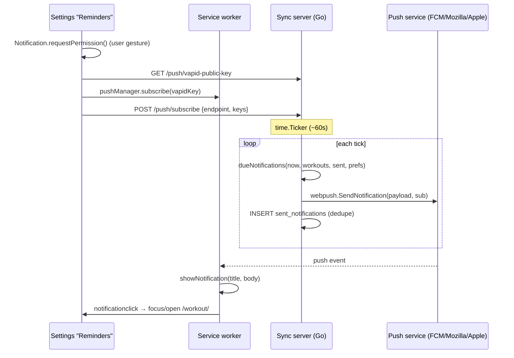

# Notifications (Web Push reminders)

How workout reminders work and how to maintain them. The design rationale and
the options that were rejected live in [`notifications.md`](../../notifications.md)
at the repo root; this doc is the implementation reference.

Two reminders are delivered:

| Kind | Fires | Keys off |
| --- | --- | --- |
| `next_workout` | on a scheduled workout day, at the user's reminder time | `workouts.scheduled_on`, `state='scheduled'` |
| `stale_workout` | 45 min after a workout is started but not finished | `workouts.started_at`, `state='in_progress'` |

## Architecture

The sync server already receives workout data, so it decides *when* to remind
from its own tables and pushes via **Web Push** — waking the closed PWA through
the browser vendor's push service. "Due" is derived from workout rows + a
persistent sent-log, so the scheduler is idempotent and crash-safe. While the
app is open, the client also shows the stale reminder locally (the reliable,
no-round-trip path).

## Where things live

| Concern | File |
| --- | --- |
| Server: VAPID, endpoints, scheduler, send | `backend/push.go` |
| Server: wiring (routes + `startScheduler`) | `backend/main.go` |
| Server: scheduler unit + schema-integration tests | `backend/push_test.go` |
| Reminder preferences (columns) | `backend/sql/schema.sql` (user_profile), `frontend/src/lib/db/types.ts` |
| Client: subscribe / permission / local notifications | `frontend/src/lib/notifications.ts` |
| Service worker: `push` + `notificationclick` | `frontend/public/sw.js` |
| Settings "Reminders" card | `frontend/src/components/apps/SettingsApp.svelte` |
| In-page 45-min stale reminder | `frontend/src/components/apps/ActiveWorkoutApp.svelte` |

## Server internals (`backend/push.go`)

- **VAPID keys** — `ensurePush()` prefers `VAPID_PUBLIC_KEY` / `VAPID_PRIVATE_KEY`
  env vars, else generates a pair once and persists it in the server-only
  `push_config` table (stable across restarts). `VAPID_SUBJECT` sets the
  contact (`mailto:` / URL); defaults to `mailto:admin@workoutt.local`.
- **Server-only tables** (never synced): `push_config`, `push_subscriptions`
  (`endpoint` UNIQUE, upserted on re-subscribe), `sent_notifications`
  (PK `(kind, workout_id)` = the dedupe log). Created idempotently on every
  boot via `pushDDL` (the server applies `schema.sql` only to a fresh DB).
- **Endpoints** — `GET /push/vapid-public-key`, `POST /push/subscribe`,
  `POST /push/unsubscribe`, registered in `main.go`.
- **Scheduler** — `startScheduler(ctx, interval)` runs a `time.Ticker`
  (`NOTIFY_INTERVAL_SECONDS`, default 60). Each tick, `runScheduleTick`:
  1. `loadPrefs()` from `user_profile` — bail unless `notifications_enabled`.
  2. `loadCandidateWorkouts()` (`state IN ('scheduled','in_progress')`).
  3. `loadSent()` → the dedupe set, `loadSubscriptions()`.
  4. `dueNotifications(now, workouts, sent, prefs)` — **pure**, unit-tested.
  5. `sendToAll()` each, then record `sent_notifications` in the same pass.
- **`dueNotifications` is the pure heart** — no DB, no clock beyond its `now`
  arg — so it's exhaustively table-tested (`TestDueNotifications`). It enforces
  the master switch, per-kind toggles, the 24-hour "don't fire ancient
  reminders" window, and the 45-minute stale threshold (`staleAfter`).
- **Dead-subscription pruning** — `sendToAll` deletes any subscription the
  push service reports `404`/`410`.

## Reminder preferences

Synced on `user_profile` (so the server can read them), read defensively:

| Field | Default | Meaning |
| --- | --- | --- |
| `notifications_enabled` | false | master switch |
| `notify_next_workout` | true | workout-day reminder |
| `notify_stale_workout` | true | left-open nudge |
| `next_workout_reminder_time` | `'08:00'` | local HH:MM on a workout day |

The push **subscription** is deliberately *not* synced — it's device-specific
and holds a secret (`auth`), so each browser registers itself.

## Client internals

- `frontend/src/lib/notifications.ts` — `subscribeThisDevice()` (fetch VAPID
  key → `pushManager.subscribe` → `POST /push/subscribe`),
  `unsubscribeThisDevice()`, `showLocalNotification()` (SW `showNotification`
  if available, else the page `Notification` constructor), and `msUntilStale()`.
  The server base URL is `getSyncUrl()` (empty = same origin).
- `sw.js` — `push` shows the payload `{title, body, url, tag}`;
  `notificationclick` focuses an open tab (navigating it to the workout) or
  opens a new one. Bump `CACHE_VERSION` when editing the SW.
- The SW only registers in a **production build** (`Layout.astro` unregisters
  it in dev to avoid stale-module caching), so `pushManager.subscribe` needs a
  prod/installed build. In dev, `subscribeThisDevice()` returns
  `{reason:'no-service-worker'}` and the UI explains that reminders still show
  while the app is open.
- `ActiveWorkoutApp.svelte` runs a `$effect` that, for an in-progress workout,
  fires the stale reminder locally at exactly `started_at + 45min` (or
  immediately if already past), guarded by `staleFiredFor` so it never
  double-fires.

## Maintaining / extending

- **Add a reminder kind:** extend `dueNotifications` with a new case + a
  `sent_notifications` key prefix, add a pref column if it's user-toggleable
  (data-model field checklist), and a test case. The tick loop, sending, and
  dedupe are generic.
- **Change timing/copy:** `staleAfter` and the `Title`/`Body` strings live in
  `push.go`; the reminder time is per-user.
- **Rotate VAPID keys:** set the env vars (invalidates existing subscriptions —
  clients re-subscribe on next Settings visit / load).
- **Tests:** `cd backend && go test ./...` covers the pure due-logic and a
  schema-integration test that runs every scheduler query against a real DB.

## Known limits (see root plan for the full list)

- The **server** needs outbound HTTPS to the push vendors; a LAN-only box can
  sync but can't push.
- iOS only issues a subscription to an installed PWA (16.4+).
- Timing granularity ≈ the ticker cadence.
- The server acts on *synced* data, so a workout finished offline may briefly
  still look open; the send-once log + gentle wording contain it.
