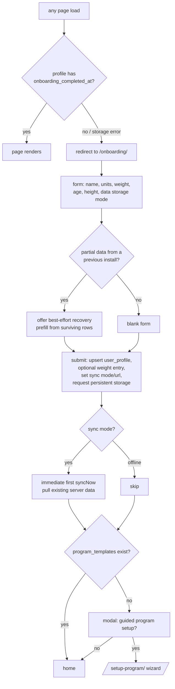

# Onboarding and the program walkthrough

How a new user gets from a blank browser to a running program, and how to
add or edit the default content (exercises, workouts, programs) the system
offers when it builds a program for them.

| Concern | File |
| --- | --- |
| Onboarding gate (every page) | `frontend/src/layouts/Layout.astro` |
| Onboarding form | `frontend/src/components/apps/OnboardingApp.svelte` |
| Program walkthrough (wizard) | `frontend/src/components/apps/SetupProgramApp.svelte` |
| Default content (plans, presets) | `frontend/src/lib/planPresets.ts` |
| Program instantiation | `startProgram()` in `frontend/src/lib/services/workouts.ts` |

## Flow



Details worth knowing:

- **The gate runs on every page** (MPA): an inline script in `Layout.astro`
  redirects to `/onboarding/` when the profile is missing or unreadable.
  Damaged storage lands on onboarding too, which offers recovery.
- **Recovery path**: if a profile exists without `onboarding_completed_at`
  (or other data survives without a profile), onboarding offers to prefill
  from what's there. Submitting **merges into the surviving profile row**
  to keep its `id` — the sync identity — intact.
- **Data storage mode**: `Offline only` sets
  `localStorage['workoutt-sync-mode'] = 'offline'`; `Sync mode` stores the
  server URL and runs a first sync immediately so existing server data is
  present before the homepage renders. See [sync.md](./sync.md).
- Experience level is *not* asked in onboarding — the wizard asks it, since
  it only matters for plan generation.

## The program walkthrough (`/setup-program/`)

Three steps, mirroring the data model's layers (exercises → workout
templates → program). **Nothing is written until the final "Create"** —
moving back and forth never creates duplicates.

1. **Step 0 — pick a starting point.** Experience level
   (beginner/intermediate/advanced) plus either a guided plan (see below)
   or "build my own from scratch".
2. **Step 1 — exercises.** The generated (or empty) exercise list; the user
   can add/remove. Exercises already in the library (matched by
   case-insensitive name) show a "will be reused" badge. The
   **"Add Unused Exercises to Database"** checkbox additionally seeds the
   full preset library at commit time and makes it selectable in step 2.
3. **Step 2 — workout templates.** Session plans built from step-1
   exercises (plus the preset library when the checkbox is on, shown in an
   "Exercise library" optgroup). A library exercise referenced by a row is
   created at commit even if the checkbox is later unchecked.
4. **Step 3 — program.** Name, frequency, length, preferred days, and an
   optional immediate start (`startProgram()` snapshots the template config
   and generates the full schedule, rotating templates across preferred
   days).

On commit, exercises are **reused by name** where possible; only missing
ones are created.

## Default content: `planPresets.ts`

All guided-plan content lives in one file, as plain data:

```ts
PLANS: Record<PlanType, PlanDef>   // the four plans
PlanDef = {
  program_name: string;
  exercises: PlanExercise[];       // c(...) = compound, iso(...) = isolation
  days: DayDef[];                  // ordered day templates, by exercise name
}
RULES: Record<ExperienceLevel, {   // how experience shapes the output
  frequency; maxCompounds; allowSupersets; weeks;
}>
```

`generatePlan(type, experience)` turns a plan + experience level into the
wizard's working set:

- takes the first `frequency` days of the plan,
- drops compounds beyond `maxCompounds` per day,
- assigns default set counts (compounds 4, isolations 3, advanced
  compounds 5, cardio machines 1 "round"),
- pairs eligible isolation exercises into clean 2-exercise supersets when
  `allowSupersets`,
- attaches per-exercise targets via `buildTarget(...)`,
- returns only the exercises the kept days actually use.

`allPresetExercises()` is the de-duplicated union of every plan's
exercises. It backs both the wizard's "add unused exercises" checkbox and
the exercises page's **"Load default exercises"** empty-state button.

### How to edit or add default content

**Edit an existing exercise/day/plan** — change the data in `PLANS`.
Exercise references inside `days` are by exact name, so rename in both
places.

**Add an exercise to a plan:**

1. Add it to `PLANS[type].exercises` with `c(name, bodyParts, measurement)`
   (compound — counts against `maxCompounds` and gets 4–5 sets) or
   `iso(...)` (isolation — superset-eligible, 3 sets).
2. Reference its name in one or more `days[].exercises` lists (order = the
   order in the workout).
3. Optionally teach `buildTarget()` its default targets (reps ranges,
   times, distances) — otherwise it gets the generic defaults.

**Add a whole new plan:**

1. Extend the `PlanType` union.
2. Add a `PLANS` entry (exercises + at least 5 days so the advanced
   frequency has enough to pick from).
3. Add a card to `PLAN_OPTIONS` (label + description shown in step 0).

**Change experience shaping** — tune `RULES` (frequency, compound cap,
supersets, weeks) and `PREFERRED_DAYS` (which weekdays each frequency
maps to).

Nothing here migrates user data: presets only materialize into real
`exercises` rows when a wizard run commits (reused by name thereafter).
