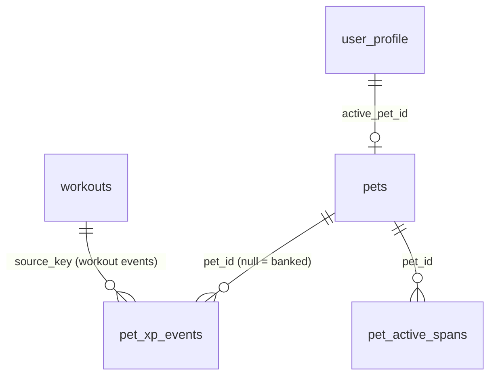
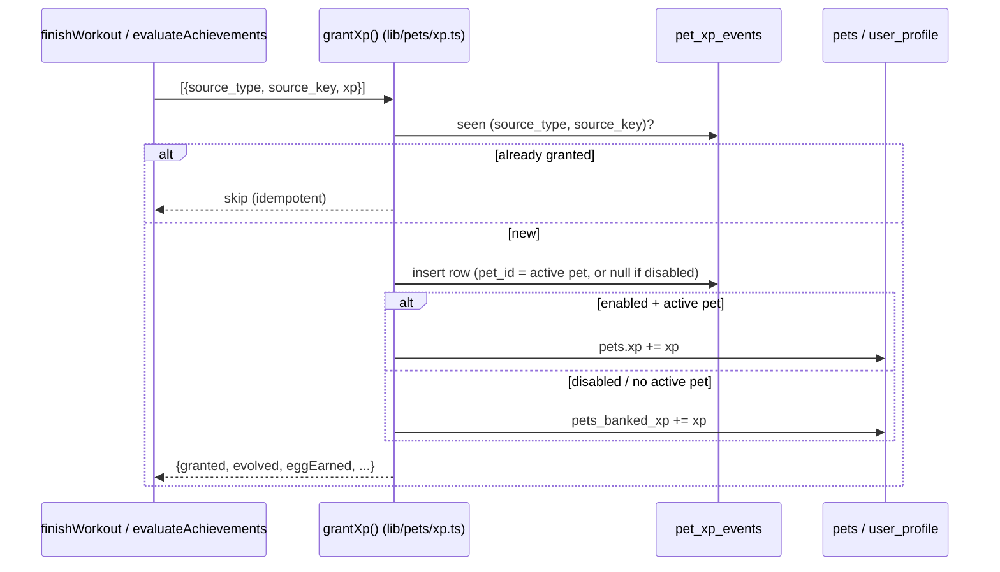

# Pets (collection game)

How the optional pet collection game works and how to extend it. The game
layers on top of the existing training data — training earns XP, XP evolves
pixel-art animals, and consistency earns eggs. It never touches or depends on
workout data being shaped a particular way; turning it off changes nothing
about training. The original design rationale lives in
[`pets.md`](../../pets.md) at the repo root; this doc is the implementation
reference.

## Where things live

| Concern | File |
| --- | --- |
| Balance constants + stage derivation | `frontend/src/lib/pets/config.ts` |
| XP engine, eggs, hatching, lifecycle, overview derivations | `frontend/src/lib/pets/xp.ts` |
| Generated names | `frontend/src/lib/pets/names.ts` |
| Sprite grids + palettes (14 species × 4 stages + egg) | `frontend/src/lib/pets/sprites/` |
| Sprite renderer + animations | `frontend/src/components/PixelSprite.svelte` |
| Pets page, hatch flow, collection, per-pet overview | `frontend/src/components/apps/PetsApp.svelte` |
| Workout XP hook | `frontend/src/lib/services/workouts.ts` (`finishWorkout`) |
| Achievement XP hook + scoring | `frontend/src/lib/achievements/evaluate.ts`, `catalogue.ts` |
| Post-workout evolution block | `frontend/src/components/apps/ActiveWorkoutApp.svelte` |
| Data model (stores + profile fields) | `backend/sql/schema.sql`, `frontend/src/lib/db/types.ts` |

## Core principles

- **Strictly optional.** Off by default. `user_profile.pets_started_at` (null
  = never opted in) gates the whole system; `pets_enabled` is the live toggle.
  When off, no XP is ledgered and nothing pet-related renders.
- **Idempotent XP.** Every XP-worthy event is one `pet_xp_events` row, unique
  on `(source_type, source_key)`. Re-evaluation, sync replays, and imports can
  never double-pay.
- **Derive where possible.** Evolution stage, eggs available, per-pet stage
  timestamps, cumulative active time, and body-part attribution are all
  computed from the ledger + spans, never stored as running state. The two
  denormalized values (`pets.xp`, `user_profile.pets_banked_xp`) are
  convenience mirrors the ledger can rebuild.

## Data model

Three synced stores plus profile fields, all following the checklists in
[`data-model.md`](./data-model.md). Every entity carries the standard
`SyncFields` tail (`id` / `updated_at` / `deleted_at` / `server_seq`).



| Store / fields | Purpose |
| --- | --- |
| `pets` | One collected animal: `species`, `name`, `xp` (lifetime; stage derived), `hatched_at`. |
| `pet_xp_events` | The idempotency ledger. `source_type` ∈ `achievement`/`workout`/`bank_spend`; `source_key` is the award tuple / workout id / one-off grant id; `pet_id` null = banked. |
| `pet_active_spans` | One row per stretch a pet was the active pet while enabled. `ended_at` null = currently active. Added for the overview page (task 1). |
| `user_profile.pets_enabled` | Live on/off toggle. |
| `user_profile.pets_started_at` | First-ever opt-in (null = never). |
| `user_profile.active_pet_id` | The current XP recipient. |
| `user_profile.pets_banked_xp` | XP accrued while disabled, spendable on re-enable. |
| `user_profile.pets_allow_duplicates` | Let eggs hatch owned species again (default false). |

Eggs are **not** stored — they are derived (see below), so there is no counter
to drift under sync.

## XP gain

Two existing pipelines feed XP; there are no new evaluation passes.



- **Workout XP** — `finishWorkout()` grants `WORKOUT_XP` (40) keyed by the
  workout id, so re-finishing after an edit never double-pays.
- **Achievement XP** — `evaluateAchievements()` returns freshly inserted
  awards; each is mapped to an event keyed by its award tuple
  (`achievement|scope_type|scope_id|tier`) and scored by `xpForAward()`.
  Because the opt-in backfill also returns "new" awards, a veteran who opts in
  gets a bounded XP windfall (the ledger dedupes, so awards credited at opt-in
  never pay twice).

`grantXp(events)` in `xp.ts` is the single entry point. It dedupes against the
ledger, writes the new rows, updates either the active pet or the bank, and
returns a `GrantResult` (`granted`, `toPet`/`banked`, `evolved`,
`stageBefore`/`stageAfter`, `eggEarned`) so callers can render toasts and the
post-workout "🦁 Roary evolved!" block.

## Balancing

All tunables live in one file — `config.ts` — so rebalancing is a one-file
change and, because stage is derived, retro-applies cleanly to every pet.

| Constant | Value | Meaning |
| --- | --- | --- |
| `WORKOUT_XP` | 40 | Flat per completed workout (submit-without-stats included). |
| `EGG_EVERY_N_WORKOUTS` | 5 | One egg per this many post-opt-in workout events. |
| `OPTIN_XP_CAP` | 1000 | Retroactive credit cap at first opt-in (one free full evolution). |
| `STAGE_THRESHOLDS` | 0 / 250 / 550 / 1000 | Lifetime XP for Baby / Juvenile / Adult / Jacked. |

Achievement scores are declared per tier in `catalogue.ts`
(`DEFAULT_TIER_XP = {0:15, 1:15, 2:25, 3:40}`, overridable per definition via
the `xp` field on a tier). `xpForAward()` reads them back.

Target: fully evolve one animal in ~50 achievements or ~20 workouts. Stage
derivation is pure:

```ts
stageForXp(xp)      // → 'baby' | 'juvenile' | 'adult' | 'jacked'
nextThreshold(xp)   // → next {stage, xp} or null when jacked
```

## Eggs & hatching

Eggs available is derived, not stored:

```
earned  = 1 (opt-in) + floor(workout_event_count / EGG_EVERY_N_WORKOUTS)
surplus = max(0, earned − pets_owned)
available = duplicatesEffective ? surplus : min(surplus, unowned_species)
```

`duplicatesEffective` is the user's `pets_allow_duplicates` preference **or**
forced true once every species is owned (otherwise there would be nothing left
to hatch). With duplicates off and a complete collection the cap is 0 (the
classic "collection complete" freeze); with duplicates on, eggs keep flowing
and `hatchEgg()` draws from all species instead of only unowned ones.

Hatching is always user-initiated (`hatchEgg()` in the Pets page). The
first-ever pet becomes active and scoops up any banked XP — that is how a
veteran's opt-in credit "maxes the first pet immediately."

## The overview page (task 1)

`PetsApp.svelte` renders the collection grid; clicking a pet's sprite opens a
detail modal built entirely from derivations in `xp.ts`:

| Feature | Function | How it's derived |
| --- | --- | --- |
| Previous forms (click to view) | — | All four stage grids from `SPRITES`; unreached stages are disabled. |
| When each stage was reached | `petStageTimeline(pet)` | Replay the pet's ledger rows sorted by `created_at`, cumulative sum, record the row that crosses each threshold. Baby = `hatched_at`. |
| Age vs. cumulative active time | `petAgeMs(pet)` / `petActiveMs(petId)` | Age = now − `hatched_at`; active = Σ over `pet_active_spans` of `(ended_at ?? now) − started_at`. |
| Top-3 trained body parts | `petTopBodyParts(petId)` | Tally body parts of exercises behind the pet's XP: workout events → the workout's `workout_exercises` → `exercises.body_parts`; exercise-scoped achievement events → that exercise's parts. |

### Active-span invariant

`pet_active_spans` is maintained by a single idempotent reconciler,
`reconcileActiveSpan()`, called after every activate / hatch / enable /
disable:

> Exactly one open span for the active pet **iff** the game is enabled with an
> active pet set; otherwise no open spans.

It closes stray/duplicate open spans (self-healing against cross-device races)
and opens one if missing. This is why switching pets, disabling, and
re-enabling all keep "time active" honest without any bespoke bookkeeping at
each call site.

## Sprite generation

Sprites are **coded pixel grids rendered as SVG** — no binary assets, crisp at
any size, reviewable diffs, and theme-aware palettes.

- Each sprite is a `SpriteGrid`: `size` rows of `size` characters
  (`frontend/src/lib/pets/sprites/types.ts`). Grid chars: `.` transparent;
  `1`–`4` the species' 4-colour palette (outline / primary / secondary /
  accent); shared chars `w` `k` `g` `d` (eye-white, near-black, dumbbell
  steels). `resolveColor(char, palette)` maps a char to a CSS colour or null.
- Silhouettes grow with stage — `STAGE_SIZES` = 16 / 18 / 20 / 24 px for baby →
  juvenile → adult → jacked — so evolution is visible in the footprint.
- One file per species exports a `SpeciesSpriteSet` (`palette` + four grids);
  `sprites/index.ts` collects them into `SPRITES` keyed by species, and
  re-exports the shared `EGG_SPRITE`.
- `PixelSprite.svelte` emits one `<rect>` per non-transparent pixel with
  `shape-rendering: crispEdges`. Worst case ~576 rects (24×24) — no run
  merging needed.

Validate new grids by rendering them (the Pets page has a dev sprite sheet at
`/pets/?sheet=1`): every row must be exactly `size` characters of the legal
alphabet.

## Animation system

`PixelSprite` takes an `animation` prop (`'none' | 'idle' | 'happy'`, type
exported from `sprites/types.ts`):

- **`idle`** — a classic two-frame JRPG bob. 1s loop with `steps(1, end)` so it
  snaps rather than glides, offset by exactly **one grid pixel**
  (`--pet-px = size / grid.size`, so it stays pixel-aligned at any display
  size). Used for resting sprites in the collection, egg tray, and detail
  modal.
- **`happy`** — a 0.9s squash-and-stretch hop (anticipation crouch → airborne
  stretch → landing squash) with `transform-origin` at the feet. Used on the
  hatch reveal and the post-workout XP moment.

Both are pure CSS keyframes and are disabled under
`prefers-reduced-motion: reduce`.

## Extending

- **Add a species:** add it to `PET_SPECIES` (`sprites/types.ts`), the
  `species` CHECK in `schema.sql`, a name list in `names.ts`, and a
  `sprites/<name>.ts` set wired into `sprites/index.ts`. The data model is
  agnostic to the count. (Remember the collection-size copy in `PetsApp` and
  the balance math in `pets.md`.)
- **Rebalance:** edit `config.ts` (thresholds / workout XP / egg cadence) or a
  tier's `xp` in `catalogue.ts`. Stage is derived, so changes retro-apply.
- **New XP source:** call `grantXp([{source_type, source_key, xp}])` with a
  stable, unique `source_key` — idempotency is automatic.
