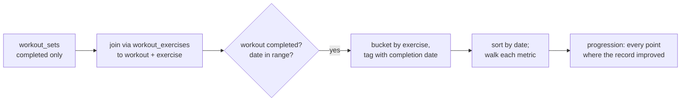
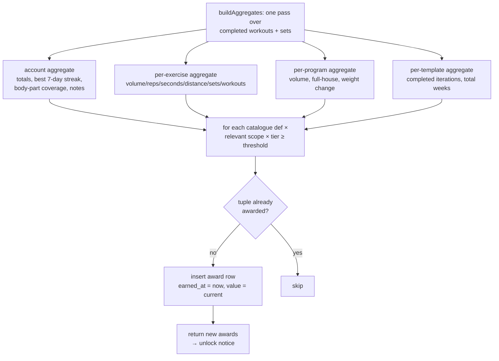

# Records, weight tracking, and achievements

How PR tracking, body-weight tracking, and the achievements system work,
and how to extend them.

## Personal records (PRs)

**PRs are derived, never stored.** Every metric is recomputed from
`workout_sets` of completed workouts. This means edits, imports, and syncs
can never leave a stale record behind.

| Concern | File |
| --- | --- |
| Derivation | `frontend/src/lib/services/records.ts` |
| Value formatting | `frontend/src/lib/utils/records-format.ts` |
| Records page (All Time / By Program) | `frontend/src/components/apps/RecordsApp.svelte` |

### Metrics per measurement type

`METRICS` in `records.ts` declares which record labels an exercise gets,
based on its `measurement_type`:

| Measurement type | Metrics |
| --- | --- |
| `reps` | Max reps |
| `weight_reps` | Max weight (secondary: reps), Max volume (single set = weight × reps) |
| `distance` | Longest distance |
| `time` | Longest time |
| `distance_time` | Longest distance (secondary: time), Best pace (sec/km, **lower is better**) |
| `weight_time` | Max weight (secondary: time), Longest time (secondary: weight) |

Each metric declares a `value(set)` extractor, an optional `secondary`
(shown alongside, e.g. "100 kg × 5"), and `lowerIsBetter` for pace-style
metrics.

### Derivation flow



`computeRecords(range?)` returns, per exercise, a **progression** per
metric — oldest first, last entry is the current PR — so the UI can show
the current record *and* its history.

The optional `range: {from, to}` (local dates) restricts which sets
participate. This powers the Records page's **By Program** view: PRs are
recomputed inside the program's date window, so an in-program best of
200 lbs shows 200 lbs even when the all-time PR is 400 lbs. No separate
table exists — it's the same derivation, scoped.

`recentPRs(limit)` flattens all progressions and returns the most recently
achieved entries (used on the homepage).

### Adding a new metric

Add an entry to `METRICS` under the right measurement type(s) in
`records.ts`. Formatting for the new label goes in `records-format.ts`.
Nothing else changes — pages render whatever metrics come back.

## Body-weight tracking

- Entries live in `body_weight_entries` (`weight_kg`, `measured_on` local
  date). Logging twice on one day upserts that day's entry.
- The Records page charts one point per day (most recently updated wins)
  and only within the configured window: `user_profile.weight_chart_months`
  (default 3, `0` = all time, set in Settings → Preferences). The history
  log below the chart always shows everything.
- The **By Program** records view and the per-program achievements both
  compute a run's weight change the same way: first vs last entry inside
  `started_on … ends_on` (or today for an active program).

## Achievements

Achievements are **derived, awarded, and persisted**: computed from
existing workout data, but once earned they are written to the synced
`achievement_awards` store with the moment they were earned, so they
survive data edits and sync across devices. Full design rationale:
`acheivements.md` at the repo root.

| Concern | File |
| --- | --- |
| Definitions (catalogue) | `frontend/src/lib/achievements/catalogue.ts` |
| Aggregation + evaluation | `frontend/src/lib/achievements/evaluate.ts` |
| Awards store | `achievement_awards` (see [data-model.md](./data-model.md)) |
| Page | `frontend/src/components/apps/AchievementsApp.svelte` |
| Unlock notice | post-workout summary modal (`ActiveWorkoutApp` → `HomeApp`) |

### The three scopes

| Scope (`scope_type`) | `scope_id` | Earned |
| --- | --- | --- |
| `account` | `''` | once ever (e.g. first workout, 10/30/100 workouts, 7-day streak) |
| `exercise` | exercise id | once per exercise per tier, gated by `measurementTypes` so a running exercise never shows a volume achievement |
| `program` | program id | once per **iteration** — re-running the program makes it earnable again |
| `program_template` | program template id | once for the template's lifetime (e.g. "ran this program 3 times") |

Tiered achievements (e.g. One tonne I/II/III) award **one row per tier**;
uniqueness is the tuple `(achievement, scope_type, scope_id, tier)`.

### Evaluation



Evaluation is **idempotent and additive** — it only inserts missing award
rows, never revokes. Re-running after a sync, an import, or a data edit is
always safe. LWW on `updated_at` keeps sync deterministic if two devices
award the same tuple concurrently.

**When it runs:**

- After finishing a workout (`completeWorkout` in
  `ActiveWorkoutApp.svelte`) — new unlocks ride along in the
  `workoutt-workout-summary` sessionStorage payload and render in the
  homepage summary modal.
- Lazily when the Achievements page mounts — this backfills anything
  missed (including all pre-feature history) with `earned_at` = first
  detected.

Note: nothing in the app currently transitions a program to
`state='completed'`; program-completion achievements (Full house, Repeat
offender…) are picked up by the lazy page-mount evaluation once such a
transition exists.

### Thresholds and units

Thresholds are stored in canonical units (kg, km, seconds); the UI converts
to the user's display units at render time, like everything else. Locked
achievements show a progress bar of `metric value / next tier threshold`.

### How to add a new achievement

1. Pick the scope and open `catalogue.ts`.
2. Add a definition to the matching array (`ACCOUNT_DEFS`, `EXERCISE_DEFS`,
   `PROGRAM_DEFS`, `TEMPLATE_DEFS`):

   ```ts
   {
     id: 'marathon_month',            // stable — it's stored in award rows
     title: 'Marathon month',
     description: 'Run 42.2 km within one program.',
     scope: 'program',
     unit: 'km',                      // drives display formatting
     tiers: [t(0, 42.2)],             // or tiered: [t(1, 10, 'I'), t(2, 25, 'II')]
     metric: (a) => a.distanceKm,     // reads the scope's aggregate
   }
   ```

   For `exercise` scope also set `measurementTypes` so it only applies
   where it makes sense.
3. If the metric needs a value the aggregate doesn't carry yet, extend the
   aggregate interface in `catalogue.ts` **and** populate it in
   `buildAggregates()` (`evaluate.ts`).
4. That's it — the page, evaluation, backfill, and unlock notice all render
   from the catalogue. Never reuse or rename a shipped `id` (award rows
   reference it); removing a definition simply hides its orphan awards.
