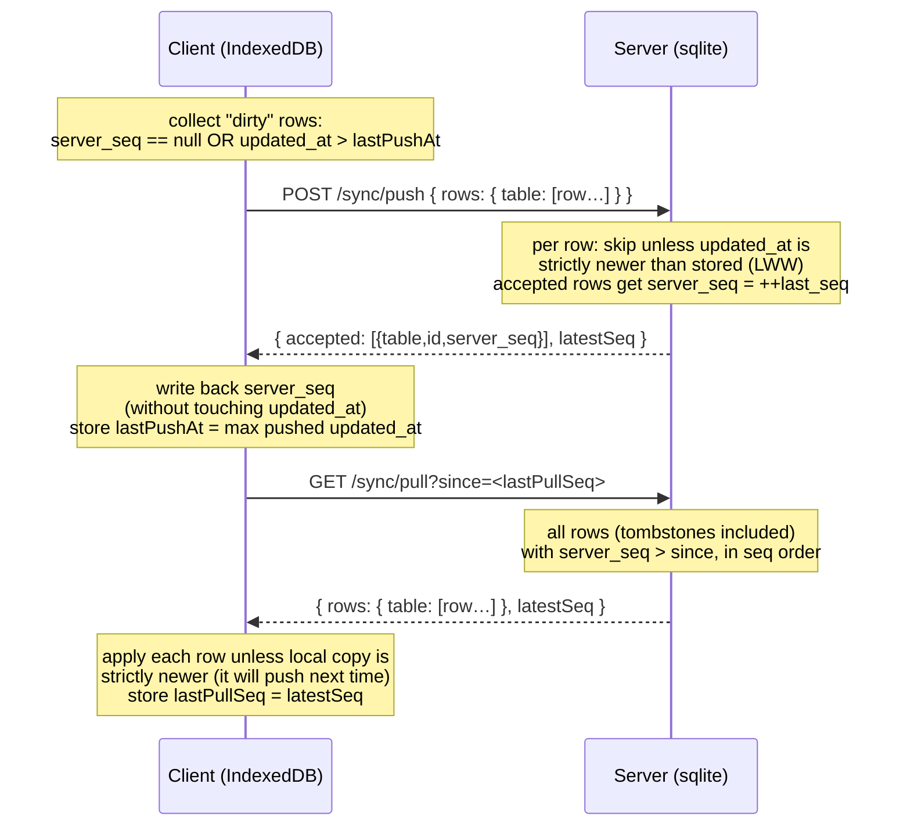
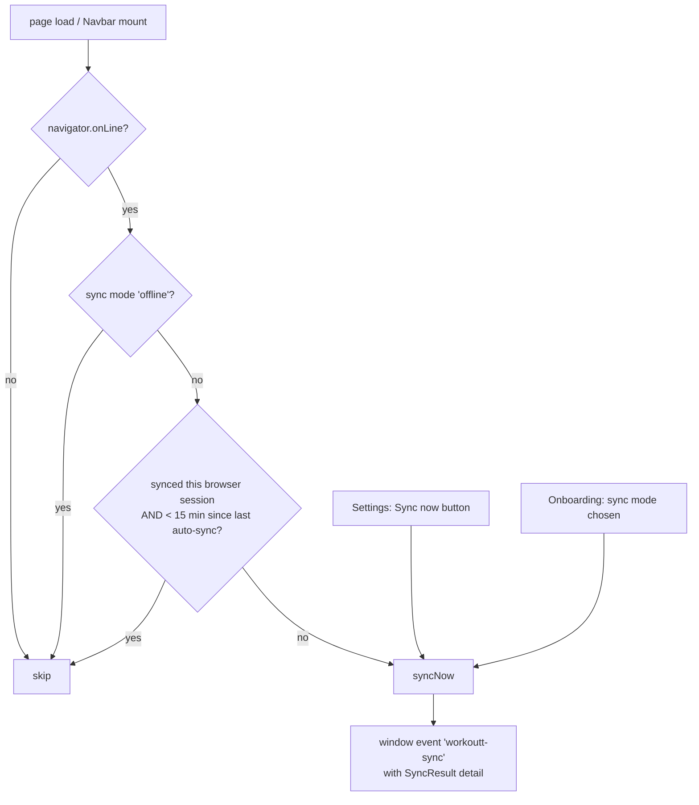

# Sync system

How the offline-first sync works, end to end: the client loop, the wire
protocol, conflict resolution, and the backend data model. Read
[data-model.md](./data-model.md) first — the sync envelope
(`id` / `updated_at` / `deleted_at` / `server_seq`) is defined there.

## Design in one paragraph

The client is fully functional offline; the Go server is a **sync target**,
not an authority. Every row carries a client-set `updated_at` (UTC ISO 8601)
used for last-write-wins conflict resolution, and a server-assigned
`server_seq` from **one global monotonic counter** used as the pull cursor.
Deletions are tombstones (`deleted_at`), so they replicate like any other
write. There is no auth — single-user, self-hosted (put a reverse proxy with
basic auth in front if ever exposed publicly).

| Concern | File |
| --- | --- |
| Client sync loop | `frontend/src/lib/sync.ts` |
| Server endpoints + table metadata | `backend/sync.go` |
| Server bootstrap (env, CORS, static) | `backend/main.go` |
| DB bootstrap + `sync_state` | `backend/db.go` |
| Shared schema | `backend/sql/schema.sql` |

## The sync round-trip

`syncNow()` (`frontend/src/lib/sync.ts`) always pushes then pulls:



### Client-side cursors (`sync_meta` store)

Device-local, never synced or exported:

| Key | Meaning |
| --- | --- |
| `lastPushAt` | max `updated_at` ever pushed; rows newer than this (or never accepted) are dirty |
| `lastPullSeq` | high-water `server_seq` already pulled |
| `lastSyncAt` / `lastError` | status surfaced in Settings |

### Conflict resolution (LWW)

- **Server, on push**: replaces a stored row only when the incoming
  `updated_at` is *strictly newer* (`backend/sync.go`, `handlePush`). ISO
  8601 UTC strings compare correctly as plain strings.
- **Client, on pull**: applies an incoming row unless the local copy is
  strictly newer — in that case the local version wins now and is pushed on
  the next cycle.

Both sides converge because both compare the same field the same way. Ties
(identical `updated_at`) keep the incumbent on the server and take the
incoming row on the client; either way the data is identical in practice.

### When sync runs



`maybeAutoSync()` is invoked from the Navbar on every page load; it
guarantees one sync per browser session plus at most one every 15 minutes
while navigating. Components can listen for the `workoutt-sync` window
event (`SYNC_EVENT`) to refresh after a pull.

### Modes and server URL

- `localStorage['workoutt-sync-mode']`: `'offline'` disables background
  sync entirely (chosen in onboarding, changeable in Settings). Anything
  else means sync.
- `localStorage['workoutt-sync-url']`: base URL of the server. Empty means
  **same-origin**, which is the correct default when the Go backend serves
  the built frontend (`STATIC_DIR`).
- `testConnection(url)` probes `GET /healthz` and maps failures to
  user-readable messages (same mapping used for push/pull errors).

## Backend

### Endpoints

| Endpoint | Purpose |
| --- | --- |
| `GET /healthz` | liveness probe (used by "Test connection") |
| `POST /sync/push` | accept rows, LWW, stamp `server_seq`, return assignments |
| `GET /sync/pull?since=N` | rows with `server_seq > N`, tombstones included |
| `GET /backup` | download the sqlite file (WAL-checkpointed first) |
| `/` (optional) | static frontend when `STATIC_DIR` is set |

Configuration is via env vars (`PORT`, `DB_PATH`, `STATIC_DIR`, `SEED`) —
see `backend/README.md`. CORS is permissive (`*`) so a separately-hosted
frontend or a dev server can sync.

### Backend data model

The server's sqlite schema **is** `backend/sql/schema.sql` — the same
tables the client mirrors, plus one bookkeeping table created in
`backend/db.go`:

```sql
sync_state (id INTEGER PRIMARY KEY CHECK (id = 1), last_seq INTEGER)
```

`last_seq` is the single global counter. `handlePush` runs in one
transaction: read `last_seq`, stamp each accepted row with `++last_seq`
via `INSERT OR REPLACE`, write the counter back, commit. `handlePull`
selects `WHERE server_seq > ?` per table in `tableOrder` (parents before
children, so a restoring client sees referenced rows first).

### Generic table metadata

The sync engine is deliberately **not** typed per-table. Rows travel as
JSON objects; `tables` in `backend/sync.go` declares, per table:

- `columns` — the exact column list (order matters for the built SQL),
- `jsonCols` — stored as JSON text, wire format is an array/object,
- `boolCols` — stored as INTEGER 0/1, wire format is a boolean.

`toDBValue` / `fromDBValue` convert between wire and storage formats.
**When the schema changes, update this metadata alongside `schema.sql` and
`types.ts`** — the checklists in [data-model.md](./data-model.md) cover the
full set of touchpoints.

The sqlite driver is `modernc.org/sqlite` (pure Go, no cgo) so the binary
cross-compiles and runs on Alpine.

## Failure behavior

- Any push/pull failure aborts the cycle, stores a readable message in
  `sync_meta.lastError` (shown in Settings), and dispatches the
  `workoutt-sync` event with `ok: false`. Local data is never rolled back —
  the next successful cycle reconciles.
- Because push happens before pull and cursors only advance on success, a
  crashed cycle re-sends at worst a superset of rows; LWW makes re-sending
  harmless (idempotent).
- A brand-new device pointed at an existing server simply pulls everything
  (`since=0`); a server restored from backup re-serves rows with their
  stored `server_seq`, and clients with a higher cursor still push their
  newer edits because dirtiness is tracked by `updated_at`/`server_seq`,
  not by the pull cursor.
