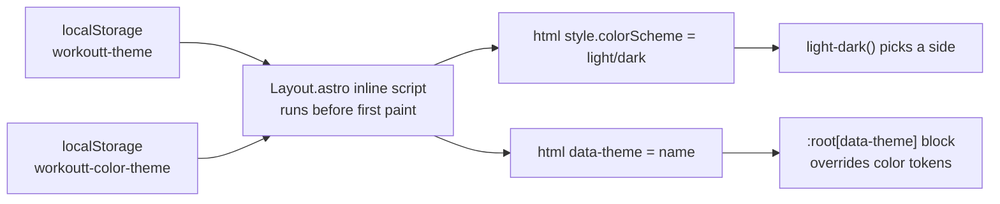

# Theming

How the theme system works, and how to modify existing themes or add new
ones.

| Concern | File |
| --- | --- |
| All design tokens + color themes | `frontend/src/styles/theme.css` |
| Global element styles | `frontend/src/styles/global.css` |
| Pre-paint application | inline script in `frontend/src/layouts/Layout.astro` |
| Settings UI (Mode + Color theme) | `frontend/src/components/apps/SettingsApp.svelte` |

## The two independent axes

Theming is two orthogonal choices, both persisted in `localStorage` and
applied to `<html>` **before first paint** to avoid a flash:

1. **Mode** — light / dark / system.
   - Every token that differs between modes is defined once with CSS
     [`light-dark()`](https://developer.mozilla.org/docs/Web/CSS/color_value/light-dark),
     e.g. `--bg-color: light-dark(#faf8f5, #16100a)`.
   - `:root { color-scheme: light dark }` opts into both; picking an
     explicit mode simply sets `document.documentElement.style.colorScheme`
     to `'light'` or `'dark'`, which flips which side of every
     `light-dark()` applies. "System" removes the override.
   - Persisted as `localStorage['workoutt-theme']` (`'light'` | `'dark'`,
     anything else = system).

2. **Color theme** — the palette (Ember default, Vigor, Nightlife, Earthy,
   Aquatic).
   - Each theme is a `:root[data-theme='<name>']` block in `theme.css` that
     overrides the same color tokens with its own `light-dark()` pairs — so
     **every color theme gets a light and a dark variant for free**.
   - Applied by setting `document.documentElement.dataset.theme`; the
     default (Ember) is the bare `:root` block, applied by *removing* the
     attribute.
   - Persisted as `localStorage['workoutt-color-theme']`.

The Settings page mutates the same two storage keys and DOM attributes at
runtime (`applyTheme` / `applyColorTheme` in `SettingsApp.svelte`), so a
change is instant and survives reloads via the pre-paint script.

## The token set

`theme.css` is the single home for every configurable token. Components
must only use tokens — never raw colors.

| Group | Tokens |
| --- | --- |
| Brand | `--color-primary`, `--color-primary-strong` (text-on-light-surface emphasis), `--color-primary-soft` (tinted backgrounds), `--color-on-primary` (text on primary) |
| Surfaces | `--bg-color`, `--surface-color`, `--surface-raised-color` (modals/cards above cards), `--border-color` |
| Text | `--text-color`, `--text-muted-color` |
| Feedback | `--color-success`, `--color-danger`, `--color-warning` |
| Typography | `--font-body`, `--font-size-sm/base/lg/xl/2xl`, `--line-height` |
| Spacing | `--space-1` … `--space-6` |
| Shape | `--radius-sm/md/lg/full` |
| Elevation | `--shadow-1`, `--shadow-2` |
| Layout | `--page-max-width`, `--navbar-height` |

Color-theme blocks override only the **color** tokens (brand, surfaces,
text); typography/spacing/shape/elevation are shared across all themes.

## Modifying an existing theme

Edit its block in `theme.css`. Each value is
`light-dark(<light value>, <dark value>)` — keep both sides. Sanity checks
worth doing for any palette change:

- `--color-on-primary` must be readable on `--color-primary` in **both**
  modes (some themes need a dark-on-light accent in dark mode — see
  Nightlife/Earthy/Aquatic, which use `light-dark()` for `on-primary` too).
- `--color-primary-strong` is used as *text* (e.g. record values) on
  `--surface-color` — check its contrast in both modes.
- `--color-primary-soft` is used as a *background* behind
  `--color-primary-strong` text (chips, badges).

## Adding a new color theme

1. In `theme.css`, copy an existing `:root[data-theme='…']` block, rename
   it, and adjust the tokens (brand + surfaces + text; feedback colors are
   optional overrides).
2. In `SettingsApp.svelte`, add `{ value: '<name>', label: '<Label>' }` to
   `COLOR_THEMES` (and the `ColorTheme` type if it enumerates values).
3. Nothing else — the pre-paint script in `Layout.astro` applies whatever
   name is stored, and Settings persists whatever is picked.

The attribute value in CSS must exactly match the `value` in
`COLOR_THEMES`; there is no build step involved.

## Adding a new token

Declare it in the bare `:root` block (with `light-dark()` if it differs by
mode). Only add per-theme overrides where a theme actually needs to differ
— everything inherits the default otherwise.
